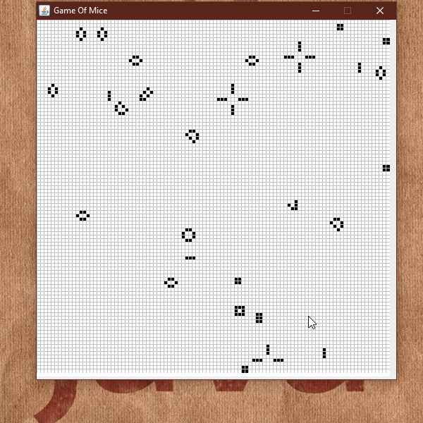

# Game Of Life

A Conway's Game Of Life made in Java  

## Instructions

Its a zero player game, but you can click to give life to some pixels

## Built With

- [Java Swing](https://docs.oracle.com/javase/tutorial/uiswing/) - The gui used

## Acknowledgments

- This is a project from MOOC.FI
- A game of life library is used
- RIP John Conway
